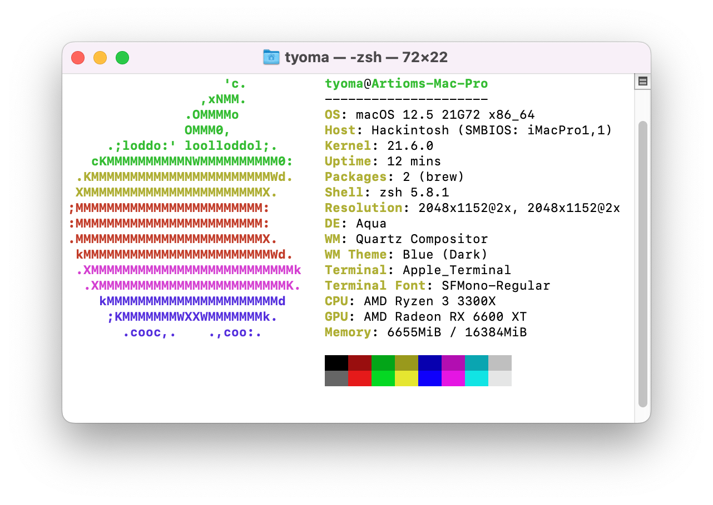

# Opencore Asus Rog Strix B450i

- This commit contains all required updates and patches for Ventura.
	> Please go to  [AMD Vanilla OpenCore](https://github.com/AMD-OSX/AMD_Vanilla/), to provide correct Core Count of your cpu.

- Added **ResetNvramEntry.efi** and **ToggleSipEntry.efi** drivers.

- Also, I had to delete all kexts, related to cpu's and gpu's stats monitoring, to avoid any issues. (Hope they will be updated soon).

	

